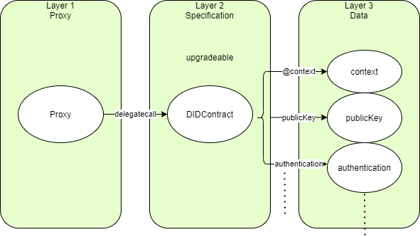

# DID-Tron-solidity Design Document

## DID Document

```json
{
  "@context": ["https://www.w3.org/ns/did/v1", "https://ontid.ont.io/did/v2"],
  "id": "did:ont:AderzAExYf7yiuHicVLKmooY51i2Cdzg72",
  "publicKey": [{...}],
  "authentication": [{...}],
  "controller": [...],
  "service": [{...}],
  "created": {...},
  "updated": {...}
}
```

## Three Layer Design Hierarchy



Refer：https://blog.openzeppelin.com/proxy-patterns/

### Layer 1

Proxy Layer, proxy the contract invoke to protocol layer.

The advantage of using proxy is that the contract can be upgraded, and the contract address of the user entrance
remains unchanged, which mainly depends on `delegatecall`.

### Layer 2

Protocol layer (logic layer), which implements the did protocol of W3C, and the logic can be changed.

Do not store their own state variables, only use the storage of layer 3 to avoid storage conflicts after upgrading.

### Layer 3

Data storage layer, using [Iterable map](../../contracts/libs/IterableMapping.sol) to store data.
The storage format of data is bytes, and the serialization and deserialization mode `abi.encode` and `abi.decode`.

```solidity
contract DataContract {
    mapping(string => IterableMapping.itmap) public data; // data storage
    ...
}
```

## Upgradeability

Since the data and the protocol are separated, you can directly modify the contract of layer 2 when upgrading is needed.
The data storage form of layer 3 is directly K-V structure, which is independent of the protocol, so there is no
modification during the upgrade.
